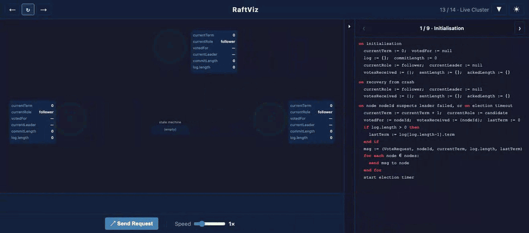
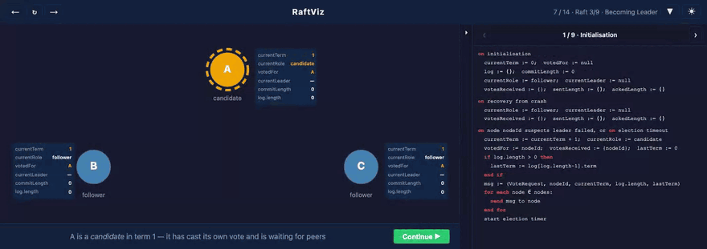
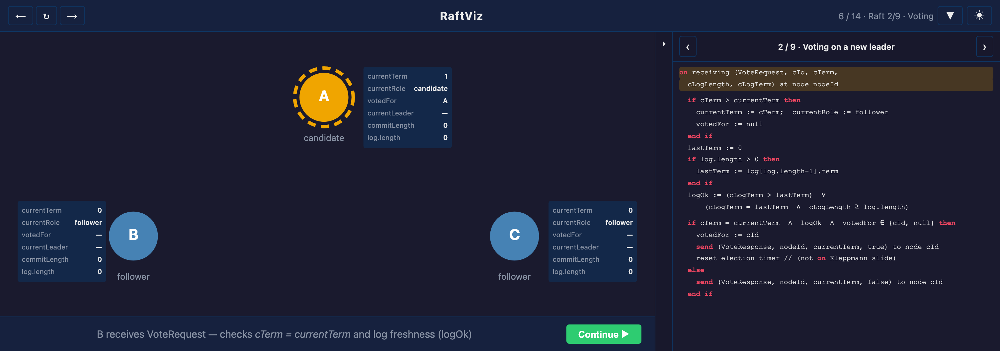
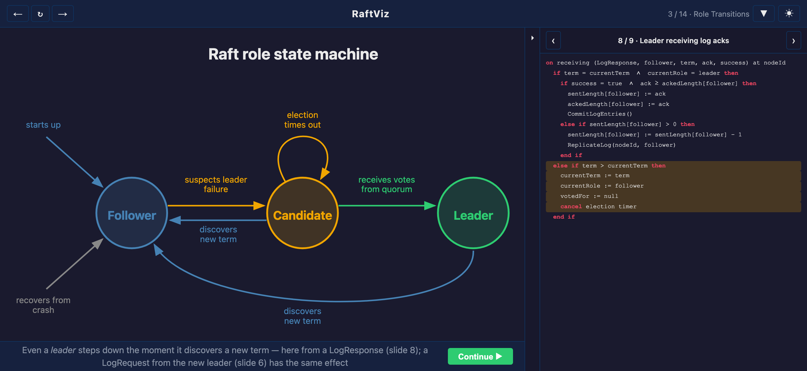
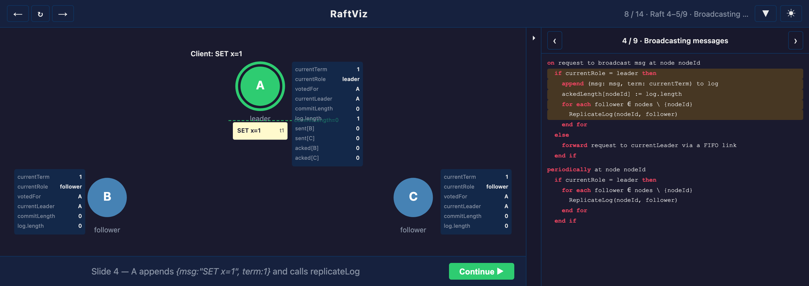
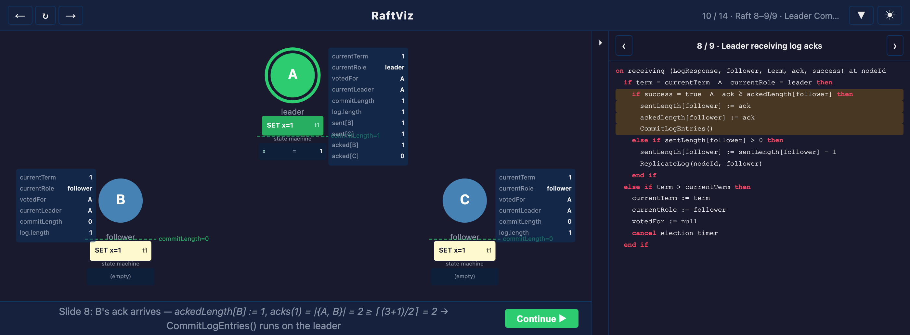
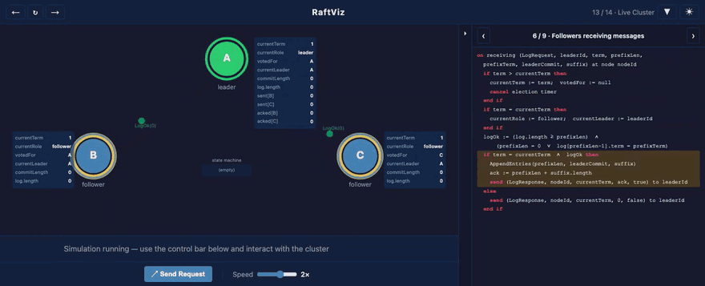
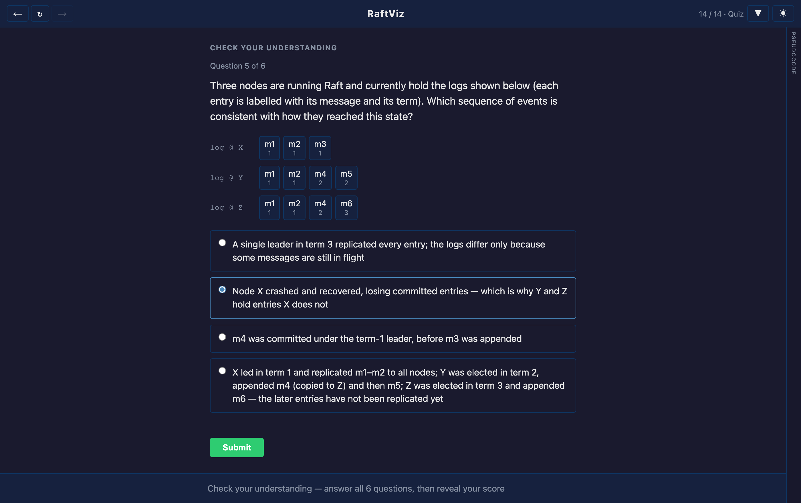
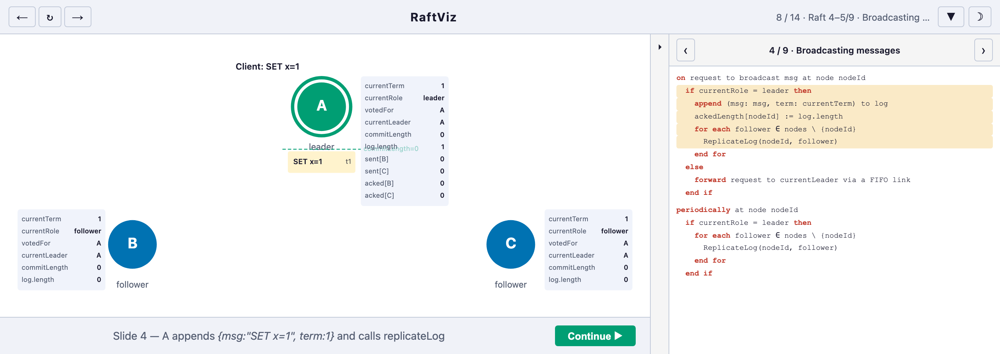
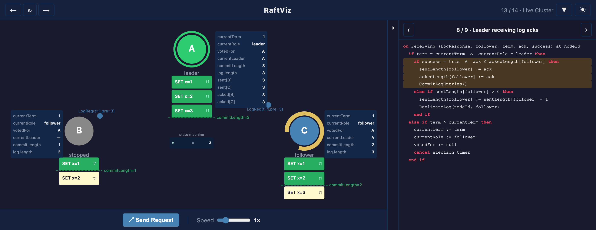

# RaftViz — a guided tour

What the visualisation shows, how to drive it, and what the colours mean.

For setup, tests and project layout, see the [README](../README.md).

Above: three Raft nodes start up, hold an election, and replicate three
client commands until they commit — with the matching line of algorithm
pseudocode highlighted on the right. Recorded at 2× speed.

---

## Contents

- [A quick tour](#a-quick-tour) — narrated scenes, the sandbox, the quiz
- [Navigating the scenes](#navigating-the-scenes) — keyboard and buttons
- [Scene index](#scene-index) — all 14 scenes and their deep links
- [Live Cluster playground](#live-cluster-playground) — controls and scenarios to try
- [Visual language](#visual-language) — what every colour means

---

## A quick tour

The visualisation has two halves: a sequence of **narrated scenes** that walk
through Raft one pseudocode line at a time, and a **free-play sandbox** where
you break the cluster yourself.

### Narrated scenes

Each scene animates one step of the algorithm, pausing so you can read what
just happened. The subtitle explains the step in prose; the panel on the right
highlights the exact lines of pseudocode being executed.

Scene 7 — a candidate collects a quorum of votes and becomes leader.

|  |  |
|--|--|
|  |  |
| **Voting** — a follower checks `cTerm` and log freshness against its own state, next to the `on receiving (VoteRequest…)` handler that implements it. | **Role transitions** — every edge of the state machine, one step at a time: both ways into the follower state (start-up and crash recovery), the three role changes, and the candidate's election-timeout retry. Each arrow highlights the handler that implements it. |
|  |  |
| **Replication** — a client command lands in the leader's log and goes out to the followers as a `LogRequest`. | **Commit** — once a quorum has acknowledged, the entry turns green and is delivered to each node's state machine. |

Every node carries a live inspector showing its Raft variables — `currentTerm`,
`votedFor`, `commitLength`, `sentLength`, `ackedLength` — so you can watch the
algorithm's state change as the animation runs, rather than inferring it.

### Free-play sandbox

Scenes 12–13 hand the cluster over to you: crash nodes, partition the network,
inject commands, and watch Raft recover.

Crashing the leader (scene 13). The survivors' election timers drain, one
becomes a candidate, and the cluster elects a new leader — then the old leader
recovers and rejoins as a follower.

The [Live Cluster playground](#live-cluster-playground) section below lists the
controls and a set of scenarios worth working through.

### Capstone quiz

A final scene checks whether the intuition actually stuck, in the style of
Will Crichton's interactive Rust Book.

### Light and dark themes

The **☀ / ☽** button in the top-right toggles the theme, and the choice is
remembered across visits. See [Visual language](#visual-language) for what the
colours mean.

---

## Navigating the scenes

| Action | How |
|--------|-----|
| Next scene / resume pause | `→` or the **→** button |
| Previous scene | `←` or the **←** button |
| Replay current scene | `R` or the **↻** button |
| Jump to any scene | **▼** scene menu (top right) |
| Deep-link to a scene | `#scene-id` in the URL (e.g. `#raft-leader`) |
| Toggle light / dark theme | **☀** / **☽** button (top right) |

When a scene pauses mid-way (a blue **▸ Resume** button appears), press `→` or
click **▸ Resume** to continue.

---

## Scene index

| # | Scene | URL hash |
|---|-------|----------|
| 1 | Welcome | `#title` |
| 2 | Overview — Consensus in One Minute | `#overview` |
| 3 | Node Role Transitions (state diagram) | `#state-diagram` |
| 4 | Raft 1/9 · Initialisation | `#raft-init` |
| 5 | Raft 1/9 · Election Timeout | `#raft-election` |
| 6 | Raft 2/9 · Voting on a New Leader | `#raft-voting` |
| 7 | Raft 3/9 · Becoming Leader | `#raft-leader` |
| 8 | Raft 4–5/9 · Broadcasting & Replication | `#raft-replication` |
| 9 | Raft 6–7/9 · Followers Receive LogRequest | `#raft-log-request` |
| 10 | Raft 8–9/9 · Leader Commits | `#raft-log-response` |
| 11 | Leader Crash & Re-election | `#raft-crash-reelection` |
| 12 | Live Playground (intro) | `#playground-intro` |
| 13 | Live Cluster (free-play sandbox) | `#live-cluster` |
| 14 | Quiz — check your understanding | `#quiz` |

---

## Live Cluster playground

Scene 13 is a fully interactive sandbox (scene 12 introduces the controls). The simulation runs autonomously, but
you control what happens to it.

Commands committed (green) across the cluster, with one node crashed. Its
`log`, `currentTerm` and `commitLength` survive the crash — they are stable
storage — while its volatile state is discarded.

### Controls

| Interaction | What it does |
|-------------|--------------|
| **Click a node** | Crash it (turns grey, stops responding). Click again to recover it as a follower. |
| **Drag from one node to another** | Add a network partition — messages between those two nodes are silently dropped. Drag between the same pair again to remove it. A dashed orange line with ⚡ marks active partitions. |
| **↗ Send Request** | Inject a `SET x=N` command into the cluster. It is sent to the current leader if one exists, otherwise to any live node. |
| **Speed slider** | Scale simulation speed from 0.5× (slow motion) to 3× (fast-forward). Default is 1×. |

### Suggested scenarios

Work through these roughly in order; each one builds on the intuition from the
last.

**1. Watch a cold start**  
Do nothing. Observe which node's election timer expires first, how it collects
votes, and how the leader begins sending heartbeats. Match what you see with
the pseudocode panel on the right.

**2. Crash the leader**  
Click the green (leader) node to crash it. Observe the remaining two followers
waiting for a heartbeat that never arrives, their election timers expiring, and
a new leader being elected from the surviving quorum. This shows *liveness*:
the cluster recovers without any human intervention.

**3. Crash a follower**  
Crash one follower while the leader is running. Inject a few requests with
**↗ Send Request**. The leader can still reach a quorum of two (itself + the
remaining follower), so commands are committed normally. Recover the crashed
node and watch it catch up: the leader replays the missing entries until the
follower's log matches.

**4. Isolate the leader (asymmetric partition)**  
Drag from the leader to each of the other two nodes in turn, creating two
partition links. The leader can no longer reach a quorum, so it stops
committing. The two followers elect a new leader among themselves. You now have
a *split-brain moment*: the old leader still thinks it is leader but is making
no progress. Recover the partitions and watch the old leader step down (its
term is stale) and rejoin as a follower.

**5. Test the quorum boundary**  
Crash two of the three nodes. The sole survivor cannot reach a quorum of two,
so no elections succeed and no commands are committed — the cluster is
*unavailable* but not incorrect. This illustrates the CAP trade-off: Raft
chooses consistency over availability when too many nodes fail.

---

## Visual language

### Node colours

| Colour | Role |
|--------|------|
| Steel blue | Follower |
| Orange | Candidate |
| Green | Leader |
| Grey | Stopped / crashed |

The arc around a node shows its election timer draining; when it reaches zero,
the node starts a new election.

### Message dot colours

| Colour | Message |
|--------|---------|
| Orange | VoteRequest |
| Bluish-green | VoteResponse (granted) |
| Vermilion | VoteResponse (denied) |
| Steel blue | LogRequest (replication / heartbeat) |
| Bluish-green | LogResponse (success) |
| Vermilion | LogResponse (failure) |

Success/failure colours use the [Okabe & Ito (2008)](https://jfly.uni-koeln.de/color/)
colorblind-safe palette and are distinguishable under all common types of
colour vision deficiency.

### Log entry colours

| Colour | State |
|--------|-------|
| Cream | Uncommitted (not yet replicated to a quorum) |
| Dark green | Committed (delivered to the application) |

### Pseudocode panel

The panel on the right shows the relevant slide of Kleppmann's Raft pseudocode
(Slides 1–9). Lines highlighted in yellow correspond to the algorithm step
currently being animated. Use the **‹** / **›** buttons to browse other slides.
